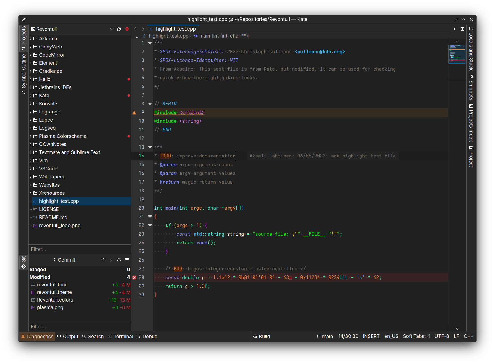

# Kate colorscheme

How-to:

Settings -> Color themes -> Theme editor -> import.

Then set it as your color theme in default theme tab.

Also on KDE Store! [https://www.pling.com/p/2041073/](https://www.pling.com/p/2041073/)
This means you can likely use the application's "Get new stuff" menu to download the colorscheme.