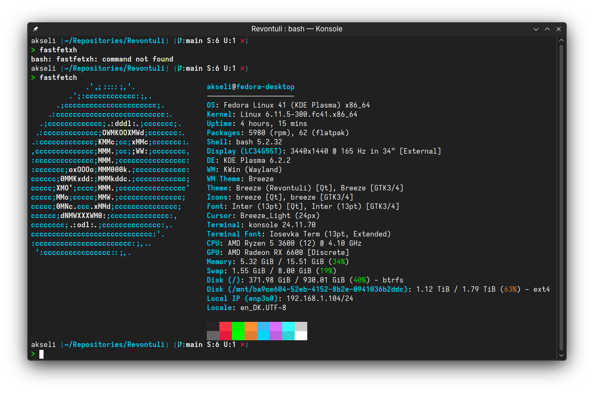

# Konsole colorscheme

How-to:

Copy `revontuli.colorscheme` to `~/.local/share/konsole`

Also on KDE Store! [https://www.pling.com/p/2041061/](https://www.pling.com/p/2041061/)
This means you can likely use the application's "Get new stuff" menu to download the colorscheme.