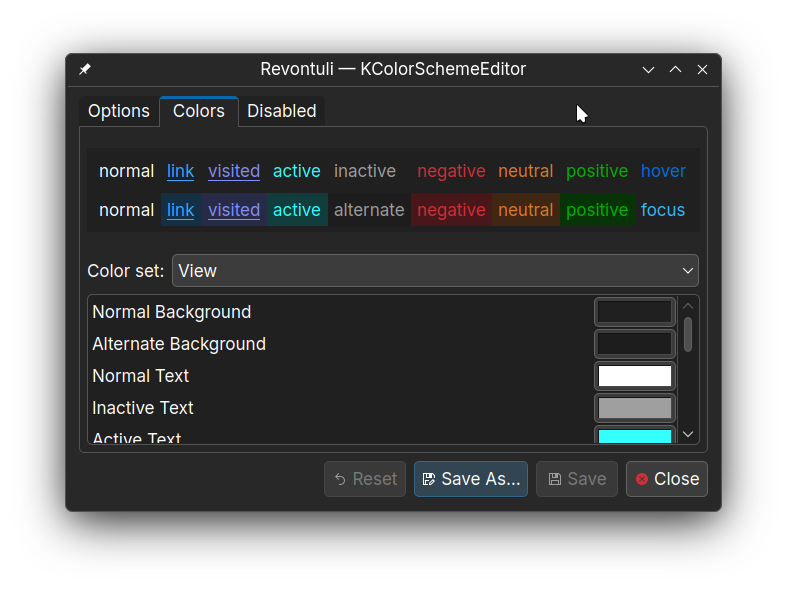

# KDE Plasma colorscheme

How-to:

Copy `Revontuli.colors` to `~/.local/share/color-schemes/`

Also on KDE Store! [https://www.pling.com/p/1971781/](https://www.pling.com/p/1971781/)
This means you can likely use the application's "Get new stuff" menu to download the colorscheme.