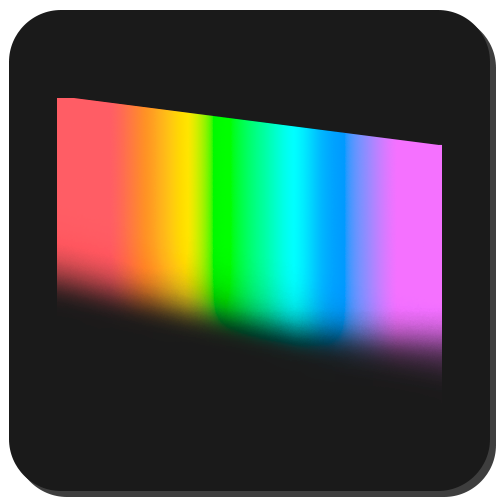

<h1 align="center">Revontuli</h1>

A high contrast-ish colorscheme

Revontuli is a dark yet vibrant colorscheme, with quite high contrast. 

Logo was made by my wife [tecsiederp](https://mastodon.art/@tecsiederp). Thanks! <3

It's not exactly a high contrast theme, but it's close!

The colorscheme started as a [Themer.dev](https://themer.dev/?colors.dark.accent0=%23ff3344&colors.dark.accent1=%2333ffa0&colors.dark.accent2=%23ff9233&colors.dark.accent3=%235fff33&colors.dark.accent4=%2333ffff&colors.dark.accent5=%2333aaff&colors.dark.accent6=%23838fff&colors.dark.accent7=%23D970FF&colors.dark.shade0=%23202020&colors.dark.shade1=%23303030&colors.dark.shade2=%23404040&colors.dark.shade3=%23505050&colors.dark.shade4=%23606060&colors.dark.shade5=%23707070&colors.dark.shade6=%23E0DCE0&colors.dark.shade7=%23FFFFFF&colors.light.accent0=%23ff3344&colors.light.accent1=%2333ffa0&colors.light.accent2=%23ff9233&colors.light.accent3=%235fff33&colors.light.accent4=%2333ffff&colors.light.accent5=%2333aaff&colors.light.accent6=%23838fff&colors.light.accent7=%23D970FF&colors.light.shade0=%23f2f2f2&colors.light.shade1=%23E0DCE0&colors.light.shade2=%23C1BCC2&colors.light.shade3=%23A29DA3&colors.light.shade4=%23847E85&colors.light.shade5=%23656066&colors.light.shade6=%23474247&colors.light.shade7=%23000000&activeColorSet=dark&calculateIntermediaryShades.dark=true&calculateIntermediaryShades.light=true) theme but it evolved into something I've been modifying a lot.
The colorscheme linked above has too many inconsistencies between applications, which is what I've been modifying.

When making a new Revontuli theme, especially for code editors,
**please follow the Kate theme settings as close as possible, so
there is an uniform syntax highlighting across applications!**

The colors are not strict! Feel free to play around with them. Just make sure the contrast is high enough for good
distinction in parts where it is important.

## Palette

### For general web/UI usage:

#### Dark

| Color                                    | Hex       | Usage                |
| ---------------------------------------- | --------- | -------------------- |
| █████ | `#282828` | Window Background    |
| █████ | `#202020` | View Background    |
| █████ | `#1d1d1d` | Alternate Background 1 |
| █████ | `#303030` | Buttons Background|
| █████ | `#404040` | Alternate Background 2 |
| █████ | `#ffffff` | Normal text          |
| █████ | `#9f9f9f` | Inactive text        |
| █████ | `#33ffff` | Active text          |
| █████ | `#33aaff` | Link text            |
| █████ | `#0078CD` | Selection text       |
| █████ | `#838fff` | Visited text         |
| █████ | `#ff3344` | Negative text        |
| █████ | `#ff9233` | Neutral text         |
| █████ | `#00d000` | Positive text        |
| █████ | `#d970ff` | Focus                |
| █████ | `#33ffa0` | Hover/Accent         |
| █████ | `#ffe033` | Special cases        |

#### Light

| Color                                    | Hex       | Usage                |
| ---------------------------------------- | --------- | -------------------- |
| █████ | `#f2f2f2` | Window Background    |
| █████ | `#B2b2b2` | Alternate Background 1 |
| █████ | `#D9D9D9` | Buttons Background|
| █████ | `#909090` | Alternate Background 2 |
| █████ | `#000000` | Normal text          |
| █████ | `#2b2b2b` | Inactive text        |
| █████ | `#28c8c8` | Active text          |
| █████ | `#2885c8` | Link text            |
| █████ | `#6770c8` | Visited text         |
| █████ | `#c82835` | Negative text        |
| █████ | `#c87028` | Neutral text         |
| █████ | `#4bc828` | Positive text        |
| █████ | `#be62df` | Focus                |
| █████ | `#28c87d` | Hover/Accent         |
| █████ | `#dfc12d` | Special cases        |

### For syntax highlighting:

See Kate syntax highlighting: [Kate Revontuli theme](Kate/revontuli.theme)

### The default shading from gray to white:

#### Dark

| Color                                    | Hex       |
| ---------------------------------------- | --------- |
| █████ | `#1d1d1d` |
| █████ | `#202020` |
| █████ | `#282828` |
| █████ | `#303030` |
| █████ | `#404040` |
| █████ | `#606060` |
| █████ | `#808080` |
| █████ | `#9F9F9F` |
| █████ | `#BFBFBF` |
| █████ | `#DFDFDF` |
| █████ | `#FFFFFF` |

#### Light

| Color                                    | Hex       |
| ---------------------------------------- | --------- |
| █████ | `#000000` |
| █████ | `#252525` |
| █████ | `#474747` |
| █████ | `#656565` |
| █████ | `#808080` |
| █████ | `#909090` |
| █████ | `#B2b2b2` |
| █████ | `#f2f2f2` |

Feel free to use midtones (like `#2b2b2b` above) whenever needed.

## Notes for specific themes

### Kate theme

**The Kate colorscheme is the most up-to-date one**, since it is my main text editor.
When it comes to syntax highlighting, please follow the Kate theme settings, so
there is an uniform syntax highlighting across applications.

### Jetbrains IDE theme
This theme can be a bit broken due to not finding
all the right elements and modifying them to match the colorscheme.

**Help is welcome.**

### Vim theme

Vim theme should work on both Vim and Neovim, I use it with Neovim.
However there are some things that may look wrong due to LSP coloring them or they just have no
colorization implemented yet.

**Help is welcome!**
