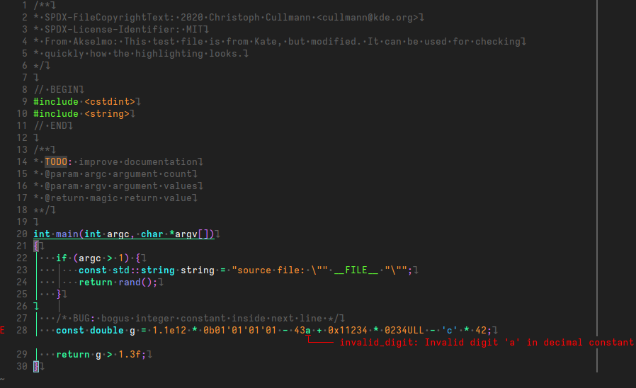

# Vim/Neovim colorscheme

**Note**, the colors are a bit off in Vim since I do not use it
as my daily editor anymore. Feel free to help me fix it and
make it more similar as Helix for example.

How-to:

[https://neovim.io/doc/user/usr_06.html](https://neovim.io/doc/user/usr_06.html)

Vim is likely the same.